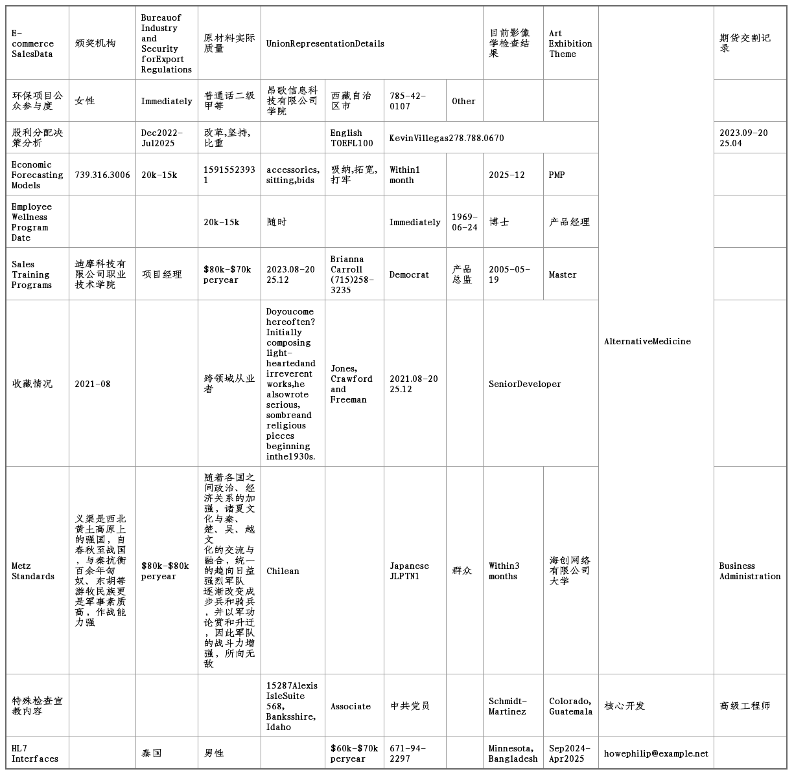
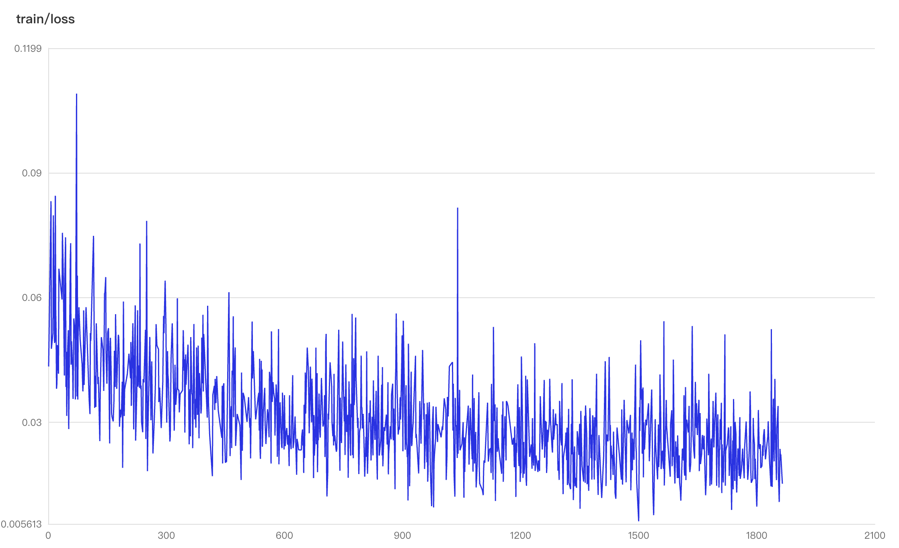
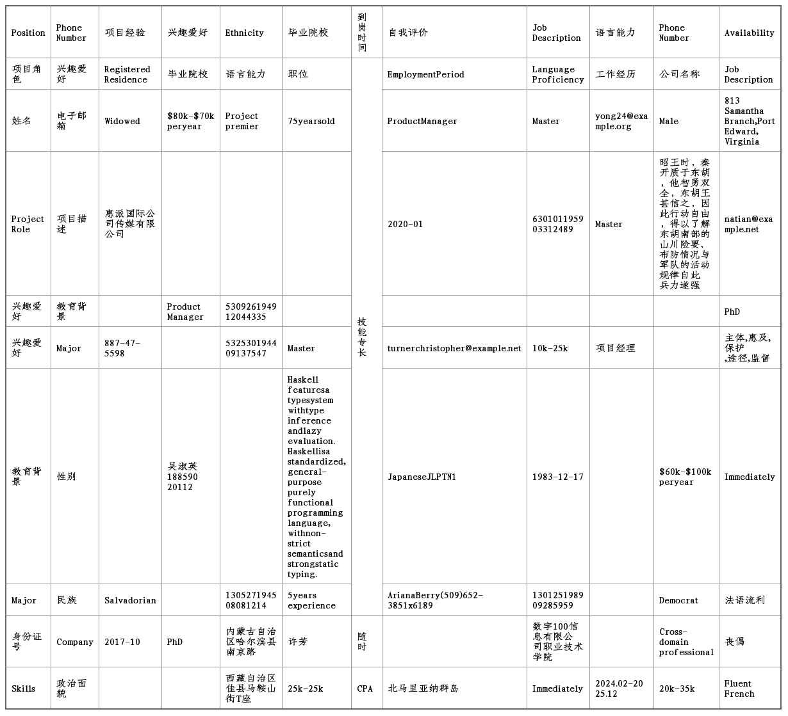
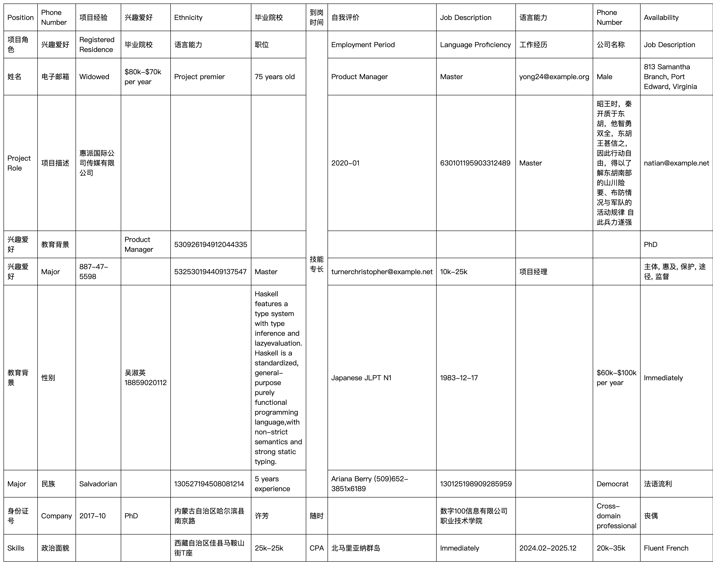

# 基于 PaddleOCR-VL-1.5微调表格数据

- [基于 PaddleOCR-VL-1.5微调表格数据](#基于 paddleocr-vl-15微调表格数据)
  - [任务简介](#任务简介)
  - [任务准备](#任务准备)
    - [模型准备](#模型准备)
    - [数据集准备](#数据集准备)
  - [训练配置](#训练配置)
  - [SFT 训练](#sft-训练)
    - [SFT 全参训练](#sft-全参训练)
    - [SFT LoRA 训练](#sft-lora-训练)
  - [模型结构说明](#模型结构说明)
    - [SFT 全参](#sft-全参)
    - [SFT LoRA](#sft-lora)
  - [推理](#推理)
    - [单样本推理](#单样本推理)
    - [测试集评估](#测试集评估)
    - [部署推理](#部署推理)
  - [注意事项](#注意事项)
    - [更多硬件上的使用说明](#更多硬件上的使用说明)


## 任务简介
PaddleOCR-VL-1.5 是 PaddleOCR-VL 的全新升级版本，作为一款 0.9B 参数量的超轻量级视觉语言模型 (VLM)，它在 OmniDocBench v1.5 上取得了 94.5% 的 SOTA 准确率，刷新了文档解析领域的性能标杆。该模型不仅延续了前代的高效特性，更在表格、公式及文本识别方面实现了显著提升。

**PaddleOCR-VL-1.5 的核心突破：**

* **极致鲁棒性**：针对真实世界的物理干扰进行了深度优化，在扫描伪影、倾斜、卷曲、屏幕翻拍及光照不均等五大复杂场景下，表现出优于主流开源及闭源模型的抗干扰能力。
* **多任务扩展**：新增了**印章识别（Seal Recognition）**与 **端到端文本定位（Text Spotting）**能力，支持不规则形状的精准定位与多边形检测，有效解决了倾斜或形变文档的解析难题。
* **长文档与多语言支持**：支持跨页表格合并与跨页段落标题识别，解决了长文档解析中的内容碎片化问题；同时扩展了对藏文、孟加拉文等语言的支持，并在生僻字、古籍、多语言表格等场景下表现优异。

**表格识别任务**

在真实业务流中，**表格（Table）**具有极高的信息密度和复杂的结构，不仅仅是文本的排列，更是逻辑关系的二维映射。

在本次微调教程中，我们将聚焦于**复杂表格识别（Complex Table Recognition）**。这不仅仅是识别单元格内的文字，更是要让模型精准理解并还原表格的结构。我们关注的复杂表格通常具有以下特征：

* **多重合并单元格**：存在大量的跨行（Rowspan）或跨列（Colspan）操作，导致视觉对齐关系与逻辑归属关系不一致。
* **嵌套与多层表头**：表头具有层级结构，需要模型理解父子层级。
* **空白表格元素**：表格具有大量的空白元素，需要模型正确处理数据稀疏场景。

本教程旨在提供基于 PaddleFormers 微调 PaddleOCR-VL-1.5 模型适配复杂表格识别任务的微调教程，值得一提的是 PaddleOCR-VL-1.5 已经具有很强的复杂表格识别能力（可通过 [PaddleOCR 官网](https://aistudio.baidu.com/paddleocr) 在线体验），本教程着重于展示如何使用复杂表格数据微调模型，资源需求和运行耗时见下方表格：

|硬件|SFT|显存|用时|
|-|-|-|-|
|8*A800|全参|37|45min|
|8*A800|LoRA|33|47min|


## 任务准备
### 模型准备
PaddleFormers 通过在训练配置文件中指定字段`model_name_or_path`来设置所用的模型。启动训练时如果本地没有该模型的缓存，那么 PaddleFormers 会自动下载模型并加载使用。

您也可以将对应的字段指定成您的本地路径，来加载已经下载好的模型。

### 数据集准备
**Demo 数据**

为了方便起见，我们提供了一个快速上手的复杂表格 Table 数据集，可用于微调 PaddleOCR-VL-1.5-0.9B 对复杂表格进行识别，该数据集为程序生成的复杂表格结构，实际内容不具备现实意义，使用以下命令下载：

```bash
wget https://paddleformers.bj.bcebos.com/datasets/ocr-vl/ocr_vl_sft_table_train.jsonl
wget https://paddleformers.bj.bcebos.com/datasets/ocr-vl/ocr_vl_sft_table_test.jsonl
wget https://paddleformers.bj.bcebos.com/datasets/ocr-vl/ocr_vl_sft_table_val.jsonl
```
其中包含训练集 `ocr_vl_sft_table_train.jsonl`、验证集 `ocr_vl_sft_table_val.jsonl` 和测试集 `ocr_vl_sft_table_test.jsonl`，对应含有 27k、2k 和 1k 的数据。示例如下：

<div align="center">
  
</div>

```json
{
    "messages": [
        {"role": "user", "content": "<image>Table Recognition:"},
        {"role": "assistant", "content": "<fcel>Customs Bond for Import/Export Compliance Assurance<fcel>Private Placement Memorandums<fcel>Human Resources Policies<fcel>Personality Assessments Conducted<fcel>Red Hat Certified Engineer<fcel>试用结束日期<fcel>Research Project Data Sharing Agreements with OtherInstitutions<fcel>Third-Party Audits<fcel>患者复诊退费记录核对情况<fcel>研究课题验收情况<fcel>公共场所卫生许可证延续情况<fcel>客户项目目标<fcel>食品安全管理人员<fcel>细胞治疗技术研发情况<fcel>科技管理记录（科技普及管理）<fcel>Machine Learning in Construction<fcel>税务稽查结果<fcel>宠物保险信息<fcel>药品生产地址<fcel>患者复诊其他费用核对记录<nl><fcel>Biometric System Integration with QR Codes forItem Tracking<ecel><ecel><ecel><ecel><ecel><ecel><ecel><ecel><ecel><ecel><ecel><ecel><ecel><ecel><ecel><ecel><lcel><ecel><ecel><nl><fcel>参与人员角色<ecel><ecel><ecel><fcel>Current Address<ecel><ecel><ecel><fcel>[dozens]<ecel><fcel>Total Cost of Ownership<fcel>[Ah]<fcel>紧急联系人<fcel>这时，陕北、晋北、冀北和内蒙古草原上的诸少数民族也强大起来，不断掳掠秦、赵、燕三国北部边境<ecel><ecel><ecel><ecel><fcel>g/s<fcel>损<nl><fcel>设备实际安装跟踪<ecel><fcel>She spent her earliest years reading classic literature, and writingpoetry. In 1989 the building was heavily damaged by fire,but it has since been restored.<ecel><fcel>Cash Flow from Operations<ecel><ecel><fcel>[dB/m]<ecel><ecel><fcel>工作经历<ecel><fcel>患者个人史<fcel>Current Address<fcel>产品退货率降低措施<ecel><fcel>Launch Promotional Activities<ecel><fcel>*<ecel><nl><fcel>活动预算分配<ecel><ecel><fcel>玉溪<fcel>医疗联合体建设情况<fcel>-160<ecel><fcel>百<ecel><ecel><ecel><ecel><ecel><ecel><fcel>95499.016<ecel><ecel><fcel>西双版纳傣族自治州<ecel><fcel>现金收入合计<nl><fcel>统计信息分析应用<ecel><ecel><ecel><ecel><ecel><fcel>凭证<ecel><fcel>Appraisals<ecel><ecel><fcel>62771.565<ecel><ecel><fcel>New Mexico, French Polynesia<ecel><ucel><fcel>Days Payable Outstanding (DPO)<ecel><ecel><nl><fcel>Mergers and Acquisitions (M&A) Activities<ecel><ecel><ecel><ecel><ecel><fcel>Architectural Firms<ecel><lcel><lcel><ecel><fcel>哈密<ecel><ecel><lcel><lcel><ucel><fcel>Financial Controls and Internal Audit<fcel>应贷科目<ecel><nl><fcel>股东持股比例变动<ecel><ecel><fcel>附<ecel><fcel>Personal Property Litigation Attorney<fcel>ID Number<ecel><ecel><fcel>She spent her earliest years reading classic literature, and writingpoetry.<ecel><ecel><fcel>Employment Period<ecel><fcel>患者就诊需求<fcel>路<ucel><ecel><lcel><lcel><nl><fcel>孕产妇死亡率<ecel><ecel><ecel><ecel><ecel><ecel><ecel><ecel><fcel>铜仁<fcel>网站用户忠诚度计划实施<ecel><fcel>工资条<ecel><ecel><ecel><ucel><ecel><ecel><ecel><nl><fcel>Estate Planning Considerations<ecel><fcel>Graduation Date<fcel><<fcel>(phots)<ecel><ecel><fcel>南平<fcel>摊销费<ecel><fcel>(percentRH)<ecel><ecel><ecel><ecel><ecel><ucel><fcel>品牌合作形式<ecel><ecel><nl><fcel>New Product Development Cycles Defined Implemented<ecel><fcel>额<ecel><ecel><ecel><ecel><fcel>13088.834<ecel><fcel>景点旅游宣传推广方案实施方案实施<ecel><lcel><lcel><lcel><lcel><lcel><ecel><fcel>(mg/dL)<ucel><ecel><nl><fcel>High-Touch Trading Fees<ecel><ecel><fcel>cP<ecel><ecel><ecel><ecel><ecel><fcel>[DWTs]<ecel><fcel>60497.569<ecel><fcel>(tbsp)<fcel>销售净利率<lcel><fcel>戳<ecel><ucel><ecel><nl><fcel>患者家属健康教育内容<ecel><ecel><ecel><ecel><ecel><fcel>dozen<fcel>图木舒克<ecel><ecel><fcel>165<ecel><fcel>锡林郭勒盟<ecel><ecel><fcel>[Gal]<ecel><fcel>收<fcel>[BRLs]<fcel>2023.07-2024.06<nl><fcel>Interpreters (biotechnology conferences)<ecel><fcel>销售主管<ecel><fcel>每股股利<fcel>年龄<ecel><ecel><ecel><ecel><ecel><ecel><fcel>Degree<ecel><fcel>四平<fcel>Field Length<ecel><ecel><fcel>Gbps<ecel><nl><fcel>患者理财计划实施时间<ecel><ecel><fcel>产品设计<fcel>Robotics Training<fcel>晋城<ecel><fcel>入<fcel>Career Objective<ecel><ecel><ecel><ecel><ecel><ecel><fcel>5年工作经验<ecel><ecel><fcel>信用评级<ecel><nl><fcel>医疗保障基金飞行检查<ecel><fcel>3.77<ecel><fcel>190<ecel><ecel><lcel><lcel><lcel><lcel><lcel><lcel><lcel><lcel><lcel><fcel>Self Evaluation<ecel><fcel>(HRBs)<ecel><nl><fcel>商品保质期<ecel><ecel><fcel>[kat]<fcel>124<fcel>0.66<fcel>89<ecel><fcel>(pg/mL)<ecel><ecel><ecel><fcel>培训虚拟现实技术应用<ecel><fcel>*<ecel><ecel><ecel><ecel><fcel>82091.066<nl><fcel>业务培训记录<ecel><ecel><fcel>参赛成绩<fcel>Position<ecel><ecel><ecel><fcel>伊春<fcel>0.59<ecel><ecel><ecel><fcel>Certifications<ecel><ecel><ecel><fcel>4.10<ecel><fcel>Waste Diversion Program Effectiveness Metrics Analysis Report<nl><fcel>Workshop Location<ecel><ecel><fcel>97945.062<fcel>项目经理<ecel><ecel><ecel><ecel><fcel>$70k-$80k per year<fcel>千<fcel>31岁<fcel>海口<fcel>数据分析日期<ecel><fcel>固定资产加速折旧<fcel>委<fcel>-42<ecel><fcel>System Log<nl><fcel>Cloud Security Assessments<ecel><fcel>API Terms of Use<ecel><ecel><fcel>列<ecel><ecel><fcel>凭证<ecel><ecel><ecel><ecel><ecel><fcel>VPN Username<ecel><ecel><fcel>Microaggressions Awareness Programs<ecel><ecel><nl><fcel>产品市场定位精准调整<ecel><ecel><ecel><ucel><fcel>[HBs]<ecel><fcel>(Bq)<ecel><fcel>$60k-$100k per year<fcel>学习空间大小<ecel><ecel><fcel>工作时间<fcel>结余<fcel>年<fcel>株洲<ecel><fcel>230602194903270826<fcel>36907.351<nl><fcel>医疗机构其他费用占比变更情况<lcel><ecel><ecel><ucel><fcel>Within 3 months<fcel>-179<ecel><ecel><ecel><fcel>Costa Rican<ecel><fcel>98708.512<ecel><ecel><ecel><ecel><ecel><ecel><ecel><nl><fcel>Promotion Code<ecel><fcel>广告创意执行<ecel><ucel><fcel>Hotel Pool Towel Replacement Policy<ecel><fcel>Cash Flow Statements<fcel>扬州<ecel><fcel>Gender<ecel><fcel>11176.107<ecel><ecel><fcel>百<ecel><fcel>193<ecel><fcel>共青团员<nl>"}
        ],
    "images": ["https://paddle-model-ecology.bj.bcebos.com/PPOCRVL/dataset/gen_from_jiaxuan/gen_1120/group2/imgs/border_2708_2LJ8OKTVBR68OTZRA5WZ_0.png"]}
```
一个 SFT 数据样本中需包含以下字段：

* `messages`：文本数据列表，记录了用户与模型之间的交互过程，其中每个元素包含一个 `role` 和一个 `content`。
    * `role`：代表消息发送者的身份。
        * `"user"`：用户，代表输入端。
        * `"assistant"`：助手/模型，代表输出端。

    * `content`：消息的具体内容。
        * 输入端包含指令和图片占位符。
            * 提示指令 `Prompt`：PaddleOCR-VL-1.5 支持以下提示指令，可根据识别任务设置
                * 文字识别 `"OCR:"`（最通用）
                * 表格识别 `"Table Recognition:"`
                * 公式识别 `"Formula Recognition:"`
                * 图表识别 `"Chart Recognition:"`
                * spotting 识别 `"Spotting:"`
                * 印章识别 `"Seal Recognition:"`
                * 或者根据微调任务自定义提示

            * 图片占位符 `<image>`：在文本数据中标记图片插入的位置。

        * 输出端包含模型预期生成的正确答案，即图片中的表格内容和结构。


* `images`：图像数据列表，存储了对话中涉及到的图片路径（本地路径或 URL）。

值得注意的是，表格结构使用 OTSL 格式表示，相关结构控制符以及具体意义如下所示：

1. `<ecel>`: 结束当前单元格（End Cell）。用于标记单元格的结束。
2. `<fcel>`: 开始一个新的单元格（First Cell）。通常用于表格中的第一个单元格。
3. `<xcel>`: 开始一个新的单元格（eXtended Cell）。用于表格中除第一个单元格外的其他单元格。
4. `<lcel>`: 结束当前行并开始新行（Last Cell）。用于标记一行的结束。
5. `<ucel>`: 合并单元格（Union Cell）。用于表示跨多行或多列的合并单元格。
6. `<nl>`: 换行（New Line）。用于文本中的换行操作。


**自行准备数据**

如果您想要基于自己的数据集进行训练，请参考 [PaddleFormers - 数据集格式文档](https://github.com/PaddlePaddle/PaddleFormers/blob/develop/docs/zh/dataset_format.md#24-%E5%A4%9A%E6%A8%A1%E6%80%81%E6%8C%87%E4%BB%A4%E5%BE%AE%E8%B0%83sft%E6%95%B0%E6%8D%AE%E6%A0%BC%E5%BC%8F) 准备数据。


## 训练配置
我们针对区域识别示例数据集提供了配置文件，其中的关键训练超参数如下：

* `num_train_epochs=2`：训练的 epoch 数。
* `warmup_ratio=0.01`：线性预热步数，根据任务困难程度调整，此处建议设置成训练步数的 1%。
* `per_device_train_batch_size=8`：每张卡的 batch size 大小，建议根据显存占用情况调整。
* `max_seq_len=16384`：最大序列长度，超出该长度的数据将被截断或者丢弃。建议在训练前估计数据集中数据长度的范围，防止大部分数据被截断从而影响训练效果。
* `gradient_accumulation_steps=1`：梯度累积步数。
    * 每达到该步数整数倍更新一次模型参数。
    * 当显存不足时，可以减小 `per_device_train_batch_size` 并增大 `gradient_accumulation_steps`。
    * 用时间换空间策略，可以减少显存占用，但会延长训练时间。

* `learning_rate`：学习率，即每次参数更新的幅度。
    * 全参训练 `learning_rate=5e-6`
    * LoRA 训练 `learning_rate=5e-4`

* 自定义模板和多模态数据处理插件
    * 由于 PaddleOCR-VL-1.5 的 `chat_template`相较于 PaddleOCR-VL 有更新，我们可以自定义新模板并通过外接的方式注册和使用。
    * `template=paddleocr_vl_v15`：指定数据预处理的模板。
    * `custom_register_path=./paddleocr_vl_v15_template.py`：指定自定义模板的文件路径。


请将以下模板文件保存至本地：

<details>
  <summary><b> PaddleOCR-VL-1.5 模板文件（点击展开/收起）</b></summary>

```python
from paddleformers.datasets.template.template import *
from paddleformers.datasets.template.mm_plugin import *
from paddleformers.datasets.template.augment_utils import *

# ==========================================
# MMPlugin
# ==========================================

@dataclass
class PaddleOCRVLV15Plugin(BasePlugin):
    image_bos_token: str = "<|IMAGE_START|>"
    image_eos_token: str = "<|IMAGE_END|>"

    def __init__(self, image_token, video_token, audio_token, **kwargs):
        super().__init__(image_token, video_token, audio_token, **kwargs)

        # here, we don't use image augmentation to simplify the training
        # you can customize the image augmentation as you like
        self.image_augmentation = self.get_ocr_augmentations(
            rotation_p=0.0,
            jpeg_p=0.0,
            scale_p=0.0,
            padding_p=0.0,
            color_jitter_p=0.0,
        )

    def get_ocr_augmentations(
        self,
        scale_range=(0.8, 1.2),
        scale_p=0.5,
        padding_range=(0, 15),
        padding_p=0.5,
        rotation_degrees=[0],
        rotation_p=0.5,
        color_jitter_p=0.5,
        jpeg_quality_range=(40, 90),
        jpeg_p=0.5,
    ):

        augmentations = []

        if scale_p > 0:
            scale_transform = RandomScale(scale_range=scale_range)
            augmentations.append(RandomApply([scale_transform], p=scale_p))

        if padding_p > 0:
            padding_transform = RandomSingleSidePadding(padding_range=padding_range, fill="white")
            augmentations.append(RandomApply([padding_transform], p=padding_p))

        if rotation_p > 0 and rotation_degrees:
            rotation_transform = RandomDiscreteRotation(degrees=rotation_degrees, interpolation="nearest", expand=True)
            augmentations.append(RandomApply([rotation_transform], p=rotation_p))

        if color_jitter_p > 0:
            color_jitter = transforms.ColorJitter(brightness=0.3, contrast=0.3, saturation=0.2, hue=0.1)
            augmentations.append(RandomApply([color_jitter], p=color_jitter_p))

        if jpeg_p > 0:
            jpeg_transform = JpegCompression(quality_range=jpeg_quality_range)
            augmentations.append(RandomApply([jpeg_transform], p=jpeg_p))

        return transforms.Compose(augmentations)

    @override
    def _preprocess_image(self, image, **kwargs):

        width, height = image.size
        image_max_pixels = kwargs["image_max_pixels"]
        image_min_pixels = kwargs["image_min_pixels"]
        image_processor = kwargs["image_processor"]

        # pre-resize before augmentation
        resized_height, resized_width = image_processor.get_smarted_resize(
            height,
            width,
            min_pixels=image_min_pixels,
            max_pixels=image_max_pixels,
        )[0]

        image = image.resize((resized_width, resized_height))

        if image and hasattr(self, "image_augmentation"):
            image = self.image_augmentation(image)

        return image

    @override
    def _get_mm_inputs(
        self,
        images,
        videos,
        audios,
        processor,
        **kwargs,
    ):
        image_processor = getattr(processor, "image_processor", None)
        mm_inputs = {}
        if len(images) != 0:
            images = self._regularize_images(
                images,
                image_max_pixels=getattr(image_processor, "max_pixels", 1003520),
                image_min_pixels=getattr(image_processor, "min_pixels", 112896),
                image_processor=image_processor,
            )["images"]
            mm_inputs.update(image_processor(images, return_tensors="pd"))

        return mm_inputs

    @override
    def process_messages(
        self,
        messages,
        images,
        videos,
        audios,
        mm_inputs,
        processor,
    ):
        self._validate_input(processor, images, videos, audios)
        self._validate_messages(messages, images, videos, audios)
        num_image_tokens = 0
        messages = deepcopy(messages)
        image_processor = getattr(processor, "image_processor")

        merge_length = getattr(image_processor, "merge_size") ** 2
        if self.expand_mm_tokens:
            image_grid_thw = mm_inputs.get("image_grid_thw", [])
        else:
            image_grid_thw = [None] * len(images)

        # here, we replace the IMAGE_PLACEHOLDER with the corresponding image tokens
        # you can customize the way of inserting image tokens as you like
        for message in messages:
            content = message["content"]
            while IMAGE_PLACEHOLDER in content:
                image_seqlen = (
                    image_grid_thw[num_image_tokens].prod().item() // merge_length if self.expand_mm_tokens else 1
                )
                content = content.replace(
                    IMAGE_PLACEHOLDER,
                    f"{self.image_bos_token}{self.image_token * image_seqlen}{self.image_eos_token}",
                    1,
                )
                num_image_tokens += 1

            message["content"] = content

        return messages

register_mm_plugin(
    name = "paddleocr_vl_v15",
    plugin_class = PaddleOCRVLV15Plugin,
)

# ==========================================
# Template
# ==========================================

register_template(
    name="paddleocr_vl_v15",
    format_user=StringFormatter(slots=["User: {{content}}\nAssistant:\n"]), # "/n" after "Assistant:"
    format_assistant=StringFormatter(slots=["{{content}}"]),
    format_system=StringFormatter(slots=["{{content}}\n"]),
    format_prefix=EmptyFormatter(slots=["<|begin_of_sentence|>"]),
    chat_sep="<|end_of_sentence|>",
    mm_plugin=get_mm_plugin(name="paddleocr_vl_v15", image_token="<|IMAGE_PLACEHOLDER|>"),
)
```
</details>

除了自定义模板的格式，PaddleFormers 还支持自定义模板的多模态数据处理插件，包括：自定义数据增强、自定义多模态 Token 以及替换形式，更多模板和多模态数据处理插件的自定义和使用请参考 [PaddleFormers - template&mm_plugin](https://github.com/PaddlePaddle/PaddleFormers/blob/develop/docs/zh/template_zh.md)。

更多相关参数可在配置文件中查看。

<details>
  <summary><b> 全参配置（点击展开/收起）</b></summary>

```yaml
### data
train_dataset_type: messages
eval_dataset_type: messages
train_dataset_path: ./ocr_vl_sft_table_train.jsonl
train_dataset_prob: "1.0"
eval_dataset_path: ./ocr_vl_sft_table_val.jsonl
eval_dataset_prob: "1.0"
max_seq_len: 16384
padding_free: True
truncate_packing: False
dataloader_num_workers: 8
mix_strategy: concat
template_backend: custom
template: paddleocr_vl_v15
custom_register_path: ./paddleocr_vl_v15_template.py

### model
model_name_or_path: PaddlePaddle/PaddleOCR-VL-1.5
_attn_implementation: flashmask

### finetuning
# base
stage: VL-SFT
fine_tuning: full
seed: 23
do_train: true
do_eval: true
per_device_eval_batch_size: 8
per_device_train_batch_size: 8
num_train_epochs: 2
max_steps: -1
max_estimate_samples: 500
eval_steps: 400
evaluation_strategy: steps
save_steps: 400
save_strategy: steps
logging_steps: 1
gradient_accumulation_steps: 1
logging_dir: ./PaddleOCR-VL-1.5-SFT-Table/visualdl_logs/
output_dir: ./PaddleOCR-VL-1.5-SFT-Table
disable_tqdm: true
eval_accumulation_steps: 16

# train
lr_scheduler_type: cosine
warmup_ratio: 0.01
learning_rate: 5.0e-6
min_lr: 5.0e-7

# optimizer
weight_decay: 0.1
adam_epsilon: 1.0e-8
adam_beta1: 0.9
adam_beta2: 0.95

# performance
tensor_model_parallel_size: 1
pipeline_model_parallel_size: 1
sharding: stage1
recompute_granularity: full
recompute_method: uniform
recompute_num_layers: 1
bf16: true
fp16_opt_level: O2

# save
unified_checkpoint: False
save_checkpoint_format: "flex_checkpoint"
load_checkpoint_format: "flex_checkpoint"
```
</details>

<details>
  <summary><b> LoRA 配置（点击展开/收起）</b></summary>

```yaml
### data
train_dataset_type: messages
eval_dataset_type: messages
train_dataset_path: ./ocr_vl_sft_table_train.jsonl
train_dataset_prob: "1.0"
eval_dataset_path: ./ocr_vl_sft_table_val.jsonl
eval_dataset_prob: "1.0"
max_seq_len: 16384
padding_free: True
truncate_packing: False
dataloader_num_workers: 8
mix_strategy: concat
template_backend: custom
template: paddleocr_vl_v15
custom_register_path: ./paddleocr_vl_v15_template.py

### model
model_name_or_path: PaddlePaddle/PaddleOCR-VL-1.5
_attn_implementation: flashmask
lora: true
lora_rank: 8

### finetuning
# base
stage: VL-SFT
fine_tuning: lora
seed: 23
do_train: true
do_eval: true
per_device_eval_batch_size: 8
per_device_train_batch_size: 8
num_train_epochs: 2
max_steps: -1
max_estimate_samples: 500
eval_steps: 400
evaluation_strategy: steps
save_steps: 400
save_strategy: steps
logging_steps: 1
gradient_accumulation_steps: 1
logging_dir: ./PaddleOCR-VL-1.5-SFT-Table-lora/visualdl_logs/
output_dir: ./PaddleOCR-VL-1.5-SFT-Table-lora
disable_tqdm: true
eval_accumulation_steps: 16

# train
lr_scheduler_type: cosine
warmup_ratio: 0.01
learning_rate: 5.0e-4
min_lr: 5.0e-5

# optimizer
weight_decay: 0.1
adam_epsilon: 1.0e-8
adam_beta1: 0.9
adam_beta2: 0.95

# performance
tensor_model_parallel_size: 1
pipeline_model_parallel_size: 1
sharding: stage1
recompute_granularity: full
recompute_method: uniform
recompute_num_layers: 1
bf16: true
fp16_opt_level: O2

# save
unified_checkpoint: False
save_checkpoint_format: "flex_checkpoint"
load_checkpoint_format: "flex_checkpoint"
```
</details>

## SFT 训练
### SFT 全参训练
使用以下命令行即可启动全参训练：

```bash
CUDA_VISIBLE_DEVICES=0,1,2,3,4,5,6,7 \
paddleformers-cli train examples/best_practices/PaddleOCR-VL-1.5/paddleocr-vl_full_16k_table_config.yaml \
                        model_name_or_path=./PaddlePaddle/PaddleOCR-VL-1.5 \
                        train_dataset_path=./ocr_vl_sft_table_train.jsonl \
                        eval_dataset_path=./ocr_vl_sft_table_val.jsonl \
                        pre_alloc_memory=30
```
设置 `pre_alloc_memory` 预分配显存从而减少显存碎片，根据序列长度、批大小和硬件显存调整。

PaddleFormers 默认使用机器上的全部 GPU，可以通过环境变量 `CUDA_VISIBLE_DEVICES` 设置 PaddleFormers 能够使用的 GPU。

可以通过 `visualdl` 对训练过程可视化，使用以下命令行即可启动（下方命令将端口 port 设置为 `8084`，需要根据实际情况设置可用端口）：

```bash
visualdl --logdir ./PaddleOCR-VL-1.5-SFT-Table/visualdl_logs/ --port 8084
```
成功启动后该服务后，在浏览器输入 `ip:port` ，则可以看到训练日志（通过 `hostname -i` 命令可以查看机器的 ip 地址）。

损失曲线如下：

<div align="center">
  
</div>


从损失曲线中可以看到，在训练起始阶段损失已经处于一个较低的数值（约 0.03），表明 PaddleOCR-VL-1.5 已经具有很强的复杂表格识别能力；随着训练进行，损失并没有显著下降，而是在一定范围内波动，说明模型通过微调获得的性能提升并不会很大。

### SFT LoRA 训练
使用以下命令行即可启动 LoRA 训练：

```bash
CUDA_VISIBLE_DEVICES=0,1,2,3,4,5,6,7 \
paddleformers-cli train examples/best_practices/PaddleOCR-VL-1.5/paddleocr-vl_lora_16k_table_config.yaml \
                        model_name_or_path=./PaddlePaddle/PaddleOCR-VL-1.5 \
                        train_dataset_path=./ocr_vl_sft_table_train.jsonl \
                        eval_dataset_path=./ocr_vl_sft_table_val.jsonl \
                        pre_alloc_memory=26
```


## 模型结构说明
### SFT 全参
全参训练结束后，模型会保存在 `output_dir=./PaddleOCR-VL-1.5-SFT-Table` 指定路径下，其中包含：

* config.json：模型配置文件
* model-0000X-of-0000Y.safetensors：模型权重文件
* model.safetensors.index.json：模型权重索引文件
* tokenizer.model & tokenizer_config.json & special_tokens_map.json & added_tokens.json：分词器文件
* train_args.bin：训练参数文件，记录训练使用的参数等
* train_state.json：训练状态文件，记录训练步数和最优指标等
* train_results.json & all_results.json：训练结果文件，记录训练进度&用时&每步耗时&每样本耗时等
* generation.json：生成配置文件
* checkpoint-[save_steps*n]：检查点文件夹，在 `save_steps` 整数倍保存训练状态，除以上文件外，还会保存 master-weight & optimizer-state & scheduler-state 等，可用于训练中断后恢复训练

### SFT LoRA
LoRA 训练结束后，模型会保存在 `output_dir=./PaddleOCR-VL-1.5-SFT-Table-lora` 指定路径下。相较于 SFT 全参，SFT LoRA 的模型结构会有所不同，其中包含：

* lora_config.json：LoRA 模型配置文件
* peft_model-0000X-of-0000Y.safetensors：LoRA 模型权重文件
* peft_model.safetensors.index.json：LoRA 权重索引文件

使用以下命令行即可合并 LoRA 权重：

```bash
CUDA_VISIBLE_DEVICES=0,1,2,3,4,5,6,7 \
paddleformers-cli export ./examples/config/run_export.yaml \
    model_name_or_path=./PaddlePaddle/PaddleOCR-VL-1.5 \
    output_dir=./PaddleOCR-VL-1.5-SFT-Table-lora
```
合并后的完整模型权重保存在 `output_dir=./PaddleOCR-VL-1.5-SFT-Table-lora/export` 路径下。

## 推理
### 单样本推理
Table 测试图像：

<div align="center">
  
</div>

使用以下命令行进行单样本推理：

```bash
python generate.py
```

<details>
  <summary><b> 单样本推理脚本（点击展开/收起）</b></summary>

```python
import requests
from io import BytesIO

import paddle
from PIL import Image
from paddleformers.transformers import AutoModelForConditionalGeneration, AutoProcessor
from paddleformers.generation import GenerationConfig

model_path = "./PaddleOCR-VL-1.5-SFT-Table"

model = AutoModelForConditionalGeneration.from_pretrained(
    model_path, convert_from_hf=True,
).eval()

# change the implementation of attention(default is "eager")
model.config._attn_implementation = "flashmask"
model.visual.config._attn_implementation = "flashmask"

processor = AutoProcessor.from_pretrained(model_path)

image_path = "https://paddle-model-ecology.bj.bcebos.com/PPOCRVL/dataset/gen_from_jiaxuan/gen_1120/group2/imgs/border_430_ERAO2IY99P8C8153A6E5_0.png"
image = Image.open(BytesIO(requests.get(image_path).content)).convert("RGB")

PROMPTS = {
    "ocr": "OCR:",
    "table": "Table Recognition:",
    "formula": "Formula Recognition:",
    "chart": "Chart Recognition:",
}
task = "table" # Options: 'ocr' | 'table' | 'chart' | 'formula'

messages = [
    {
        "role": "user",
        "content": [
            {
                "type": "image",
                "image": image
            },
            {"type": "text", "text": PROMPTS[task]},
        ],
    }
]

# Preparation for inference
inputs = processor.apply_chat_template(
    messages, tokenize=True, add_generation_prompt=True, return_dict=True, return_tensors="pd",
)

generation_config = GenerationConfig(
    do_sample=False, # greedy_search
    bos_token_id=1,
    eos_token_id=2,
    pad_token_id=0,
    use_cache=True
)

with paddle.no_grad():
    generated_ids = model.generate(**inputs, generation_config=generation_config, max_new_tokens=1024)
    generated_ids = generated_ids[0].tolist()[0]
    output_text = processor.decode(generated_ids, skip_special_tokens=True)

print(output_text)

# GT = <fcel>Name<fcel>专业<fcel>Career Objective<fcel>公司名称<fcel>学历<fcel>Expected Salary<fcel>Self Evaluation<fcel>Age<fcel>Project Role<fcel>电子邮箱<fcel>Registered Residence<fcel>身份证号<fcel>专业<fcel>Graduation Date<fcel>学历<nl><fcel>Emergency Contact<ecel><ecel><ecel><ecel><ecel><ecel><ecel><ecel><ecel><ecel><ecel><ecel><ecel><ecel><nl><fcel>Education<ecel><ecel><fcel>湘西土家族苗族自治州<fcel>(m3/s)<ecel><ecel><fcel>1799.171<ecel><fcel>Current Address<fcel>万<fcel>Zero Defect Metrics<ucel><fcel>项目经验<ecel><nl><fcel>身份证号<ecel><ecel><fcel>38319.16<ucel><ecel><ecel><fcel>留学生培养情况<ecel><ucel><ecel><ecel><ucel><ecel><fcel>mOsm<nl><fcel>Marital Status<ecel><fcel>-144<fcel>(nanosecs)<ucel><ecel><ecel><fcel>捆<ecel><ucel><fcel>宜宾<ecel><ucel><fcel>内部交易抵销<fcel>李秀英<nl><fcel>工作内容<ecel><fcel>锡林郭勒盟<ecel><ucel><ecel><fcel>230111197902277412<fcel>89340.869<ecel><ucel><fcel>Supplier Negotiation and Contracting Strategies<fcel>未收金额<ucel><fcel>尺码<ecel><nl><ucel><ecel><ecel><fcel>个税起征点<ucel><ecel><ecel><ecel><ecel><ucel><fcel>市场增加值<fcel>[mmHg]<ucel><ecel><ecel><nl><ucel><ecel><ecel><ecel><ucel><ecel><ecel><ecel><ecel><ecel><ecel><ecel><ucel><ecel><ecel><nl><ucel><ecel><ecel><fcel>事假扣款<ucel><fcel>凭证<ecel><fcel>邯郸<ucel><ecel><ecel><ecel><ucel><ecel><fcel>摘要<nl><ucel><ecel><ecel><fcel>g<ucel><ecel><ecel><ecel><ucel><ecel><ecel><ecel><fcel>自我评价<fcel>(tbsp)<ecel><nl><ucel><ecel><ecel><ecel><ucel><ecel><ecel><ecel><ucel><ecel><ecel><fcel>Bachelor<fcel>遵义<fcel>分<ecel><nl><ucel><ecel><fcel>Quantum Computing<ecel><ucel><fcel>Interbank Networks<fcel>雅安<ecel><ucel><fcel>19287.44<fcel>栋<ucel><fcel>朝阳<ecel><ecel><nl><ucel><ecel><fcel>双<ecel><ucel><ecel><fcel>增值税<ecel><ucel><ecel><fcel>账面数量<ucel><fcel>Hobbies<fcel>Male<ecel><nl><ucel><ecel><ecel><lcel><ucel><ecel><ecel><fcel>5552.122<ecel><fcel>Online Learning in Compliance Modelsfor Economics<fcel>海西蒙古族藏族自治州<ecel><fcel>Wb<ecel><fcel>kg/h<nl><ucel><ecel><fcel>kgf<fcel>新兴市场开拓成效<ucel><ecel><ucel><ucel><ecel><ecel><fcel>电子邮箱<fcel>应贷科目<fcel>(ug/m3)<fcel>(srs)<ecel><nl>
# Excepted Answer = <fcel>Name<fcel>专业<fcel>Career Objective<fcel>公司名称<fcel>学历<fcel>Expected Salary<fcel>Self Evaluation<fcel>Age<fcel>Project Role<fcel>电子邮箱<fcel>Registered Residence<fcel>身份证号<fcel>专业<fcel>Graduation Date<fcel>学历<nl><fcel>Emergency Contact<ecel><ecel><ecel><ecel><ecel><ecel><ecel><ecel><ecel><ecel><ecel><ecel><ecel><ecel><nl><fcel>Education<ecel><ecel><fcel>湘西土家族苗族自治州<fcel>(m3/s)<ecel><ecel><fcel>1799.171<ecel><fcel>Current Address<fcel>万<fcel>Zero Defect Metrics<ucel><fcel>项目经验<ecel><nl><fcel>身份证号<ecel><ecel><fcel>38319.16<ucel><ecel><ecel><fcel>留学生培养情况<ecel><ucel><ecel><ecel><ucel><ecel><fcel>mOsm<nl><fcel>Marital Status<ecel><fcel>-144<fcel>(nanosecs)<ucel><ecel><ecel><fcel>捆<ecel><ucel><fcel>宜宾<ecel><ucel><fcel>内部交易抵销<fcel>李秀英<nl><fcel>工作内容<ecel><fcel>锡林郭勒盟<ecel><ucel><ecel><fcel>230111197902277412<fcel>89340.869<ecel><ucel><fcel>Supplier Negotiation and Contracting Strategies<fcel>未收金额<ucel><fcel>尺码<ecel><nl><ucel><ecel><ecel><fcel>个税起征点<ucel><ecel><ecel><ecel><ecel><ucel><fcel>市场增加值<fcel>[mmHg]<ucel><ecel><ecel><nl><ucel><ecel><ecel><ecel><ucel><ecel><ecel><ecel><ecel><ecel><ecel><ecel><ucel><ecel><ecel><nl><ucel><ecel><ecel><fcel>事假扣款<ucel><fcel>凭证<ecel><fcel>邯郸<ucel><ecel><ecel><ecel><ucel><ecel><fcel>摘要<nl><ucel><ecel><ecel><fcel>g<ucel><ecel><ecel><ecel><ucel><ecel><ecel><ecel><fcel>自我评价<fcel>(tbsp)<ecel><nl><ucel><ecel><ecel><ecel><ucel><ecel><ecel><ecel><ucel><ecel><ecel><fcel>Bachelor<fcel>遵义<fcel>分<ecel><nl><ucel><ecel><fcel>Quantum Computing<ecel><ucel><fcel>Interbank Networks<fcel>雅安<ecel><ucel><fcel>19287.44<fcel>栋<ucel><fcel>朝阳<ecel><ecel><nl><ucel><ecel><fcel>双<ecel><ucel><ecel><fcel>增值税<ecel><ucel><ecel><fcel>账面数量<ucel><fcel>Hobbies<fcel>Male<ecel><nl><ucel><ecel><ecel><lcel><ucel><ecel><ecel><fcel>5552.122<ecel><fcel>Online Learning in Compliance Modelsfor Economics<fcel>海西蒙古族藏族自治州<ecel><fcel>Wb<ecel><fcel>kg/h<nl><ucel><ecel><fcel>kgf<fcel>新兴市场开拓成效<ucel><ecel><ucel><ucel><ecel><ecel><fcel>电子邮箱<fcel>应贷科目<fcel>(ug/m3)<fcel>(srs)<ecel><nl>
```
</details>

预期输出为测试图像中的表格内容和结构。

为了直观展示表格结构，我们可以将 OTSL 格式转为 HTML 格式，该功能依赖 PaddleX，使用以下命令行安装 PaddleX 库：

```bash
pip install "paddlex[ocr]"
```
更多安装方式请参考 [PaddleX 安装教程](https://paddlepaddle.github.io/PaddleX/latest/installation/installation.html)。使用以下命令行进行格式转换：

```bash
python otsl2html.py
```

<details>
  <summary><b> OTSL2HTML 转换脚本（点击展开/收起）</b></summary>

```python
from paddlex.inference.pipelines.paddleocr_vl.uilts import convert_otsl_to_html

table_otsl = "<fcel>Name<fcel>专业<fcel>Career Objective<fcel>公司名称<fcel>学历<fcel>Expected Salary<fcel>Self Evaluation<fcel>Age<fcel>Project Role<fcel>电子邮箱<fcel>Registered Residence<fcel>身份证号<fcel>专业<fcel>Graduation Date<fcel>学历<nl><fcel>Emergency Contact<ecel><ecel><ecel><ecel><ecel><ecel><ecel><ecel><ecel><ecel><ecel><ecel><ecel><ecel><nl><fcel>Education<ecel><ecel><fcel>湘西土家族苗族自治州<fcel>(m3/s)<ecel><ecel><fcel>1799.171<ecel><fcel>Current Address<fcel>万<fcel>Zero Defect Metrics<ucel><fcel>项目经验<ecel><nl><fcel>身份证号<ecel><ecel><fcel>38319.16<ucel><ecel><ecel><fcel>留学生培养情况<ecel><ucel><ecel><ecel><ucel><ecel><fcel>mOsm<nl><fcel>Marital Status<ecel><fcel>-144<fcel>(nanosecs)<ucel><ecel><ecel><fcel>捆<ecel><ucel><fcel>宜宾<ecel><ucel><fcel>内部交易抵销<fcel>李秀英<nl><fcel>工作内容<ecel><fcel>锡林郭勒盟<ecel><ucel><ecel><fcel>230111197902277412<fcel>89340.869<ecel><ucel><fcel>Supplier Negotiation and Contracting Strategies<fcel>未收金额<ucel><fcel>尺码<ecel><nl><ucel><ecel><ecel><fcel>个税起征点<ucel><ecel><ecel><ecel><ecel><ucel><fcel>市场增加值<fcel>[mmHg]<ucel><ecel><ecel><nl><ucel><ecel><ecel><ecel><ucel><ecel><ecel><ecel><ecel><ecel><ecel><ecel><ucel><ecel><ecel><nl><ucel><ecel><ecel><fcel>事假扣款<ucel><fcel>凭证<ecel><fcel>邯郸<ucel><ecel><ecel><ecel><ucel><ecel><fcel>摘要<nl><ucel><ecel><ecel><fcel>g<ucel><ecel><ecel><ecel><ucel><ecel><ecel><ecel><fcel>自我评价<fcel>(tbsp)<ecel><nl><ucel><ecel><ecel><ecel><ucel><ecel><ecel><ecel><ucel><ecel><ecel><fcel>Bachelor<fcel>遵义<fcel>分<ecel><nl><ucel><ecel><fcel>Quantum Computing<ecel><ucel><fcel>Interbank Networks<fcel>雅安<ecel><ucel><fcel>19287.44<fcel>栋<ucel><fcel>朝阳<ecel><ecel><nl><ucel><ecel><fcel>双<ecel><ucel><ecel><fcel>增值税<ecel><ucel><ecel><fcel>账面数量<ucel><fcel>Hobbies<fcel>Male<ecel><nl><ucel><ecel><ecel><lcel><ucel><ecel><ecel><fcel>5552.122<ecel><fcel>Online Learning in Compliance Modelsfor Economics<fcel>海西蒙古族藏族自治州<ecel><fcel>Wb<ecel><fcel>kg/h<nl><ucel><ecel><fcel>kgf<fcel>新兴市场开拓成效<ucel><ecel><ucel><ucel><ecel><ecel><fcel>电子邮箱<fcel>应贷科目<fcel>(ug/m3)<fcel>(srs)<ecel><nl>"

table_html = convert_otsl_to_html(table_otsl)

style = """
<style>
table {
  border-collapse: collapse;
  width: 100%;
}
td, th {
  border: 1px solid black;
  padding: 8px;
}
</style>
"""
full_html = f"<html><head>{style}</head><body>{table_html}</body></html>"

with open("table_test_html.html", "w", encoding="utf-8") as f:
    f.write(full_html)
print("Save to table_test_html.html")

```

</details>

得到的 HTML 格式表格如下：

```html
<html><head>
<style>
table {
  border-collapse: collapse;
  width: 100%;
}
td, th {
  border: 1px solid black;
  padding: 8px;
}
</style>
</head><body><table><tr><td>Name</td><td>专业</td><td>Career Objective</td><td>公司名称</td><td>学历</td><td>Expected Salary</td><td>Self Evaluation</td><td>Age</td><td>Project Role</td><td>电子邮箱</td><td>Registered Residence</td><td>身份证号</td><td>专业</td><td>Graduation Date</td><td>学历</td></tr><tr><td>Emergency Contact</td><td></td><td></td><td></td><td></td><td></td><td></td><td></td><td></td><td></td><td></td><td></td><td rowspan="8"></td><td></td><td></td></tr><tr><td>Education</td><td></td><td></td><td>湘西土家族苗族自治州</td><td rowspan="13">(m3/s)</td><td></td><td></td><td>1799.171</td><td></td><td rowspan="5">Current Address</td><td>万</td><td>Zero Defect Metrics</td><td>项目经验</td><td></td></tr><tr><td>身份证号</td><td></td><td></td><td>38319.16</td><td></td><td></td><td>留学生培养情况</td><td></td><td></td><td></td><td></td><td>mOsm</td></tr><tr><td>Marital Status</td><td></td><td>-144</td><td>(nanosecs)</td><td></td><td></td><td>捆</td><td></td><td>宜宾</td><td></td><td>内部交易抵销</td><td>李秀英</td></tr><tr><td rowspan="10">工作内容</td><td></td><td>锡林郭勒盟</td><td></td><td></td><td>230111197902277412</td><td>89340.869</td><td></td><td>Supplier Negotiation and Contracting Strategies</td><td>未收金额</td><td>尺码</td><td></td></tr><tr><td></td><td></td><td>个税起征点</td><td></td><td></td><td></td><td></td><td>市场增加值</td><td>[mmHg]</td><td></td><td></td></tr><tr><td></td><td></td><td></td><td></td><td></td><td></td><td rowspan="6"></td><td></td><td></td><td></td><td></td><td></td></tr><tr><td></td><td></td><td>事假扣款</td><td>凭证</td><td></td><td>邯郸</td><td></td><td></td><td></td><td></td><td>摘要</td></tr><tr><td></td><td></td><td>g</td><td></td><td></td><td></td><td></td><td></td><td></td><td>自我评价</td><td>(tbsp)</td><td></td></tr><tr><td></td><td></td><td></td><td></td><td></td><td></td><td></td><td></td><td rowspan="3">Bachelor</td><td>遵义</td><td>分</td><td></td></tr><tr><td></td><td>Quantum Computing</td><td></td><td>Interbank Networks</td><td>雅安</td><td></td><td>19287.44</td><td>栋</td><td>朝阳</td><td></td><td></td></tr><tr><td></td><td>双</td><td></td><td></td><td>增值税</td><td></td><td></td><td>账面数量</td><td>Hobbies</td><td>Male</td><td></td></tr><tr><td></td><td colspan="2"></td><td></td><td rowspan="2"></td><td rowspan="2">5552.122</td><td></td><td>Online Learning in Compliance Modelsfor Economics</td><td>海西蒙古族藏族自治州</td><td></td><td>Wb</td><td></td><td>kg/h</td></tr><tr><td></td><td>kgf</td><td>新兴市场开拓成效</td><td></td><td></td><td></td><td>电子邮箱</td><td>应贷科目</td><td>(ug/m3)</td><td>(srs)</td><td></td></tr></table></body></html>
```
<div align="center">
  
</div>

### 测试集评估
微调前后的模型测试集评估结果如下：

|Model|Avg. NED||Avg. TEDS||
|-|-|-|-|-|
||structure|overall|structure|overall|
|PaddleOCR-VL-1.5|0.9906|0.9683|0.9867|0.9661|
|PaddleOCR-VL-1.5Table-SFT (Full)|0.9925|0.9749|0.9899|0.96740|
|PaddleOCR-VL-1.5Table-SFT (LoRA)|0.9909|0.9703|0.9872|0.9687|

从指标中可以看到，微调前后模型的性能提升并不会很大，符合训练损失曲线的观察。在微调模型前应该先使用任务数据在基座模型上进行测试，如果指标结果不符合预期再收集任务数据进行微调。

### 部署推理
部署 PaddleOCR-VL-1.5 模型，请参考 [PaddleFormers - 模型部署文档](https://github.com/PaddlePaddle/PaddleFormers/blob/develop/docs/zh/deployment_guide.md) 和 [FastDeploy - PaddleOCR-VL-0.9B Best Practices](https://paddlepaddle.github.io/FastDeploy/zh/best_practices/PaddleOCR-VL-0.9B/)


## 注意事项
### 更多硬件上的使用说明
PaddleOCR-VL-1.5 支持基于昆仑芯 P800 和天数智芯 150s 进行微调。本教程选用了规模较大的数据集，在部分硬件上运行时间可能较长，如果希望**快速跑通流程**，或仅需验证**国产硬件环境的兼容性**，建议优先参考我们的 [PaddleFormers - 基于 PaddleOCR-VL 微调实现孟加拉语识别能力](https://github.com/PaddlePaddle/PaddleFormers/tree/develop/examples/best_practices/PaddleOCR-VL)，该教程使用精简数据集，可在短时间内完成微调全链路，助力迅速掌握多硬件适配技巧。
